# الدليل الشامل والمخطط العام لنظام إكرام (Master System Map)
**المشروع:** نظام جمعية إكرام لحفظ النعمة (IKRAM SYSTEM)  
**نوع المخرج:** تقرير تدقيق معمارية الوضع الراهن الشامل (Comprehensive AS-IS System Audit)  
**البيئة التقنية:** Laravel 11.x (PHP 8.2+) + React 18 / Vite SPA + MySQL 8.x  
**التاريخ:** سبتمبر 2026

---

## 1. الإحصائيات والمؤشرات المعمارية المؤكدة (System Verification Metrics)

بناءً على الفحص الشامل والمكتمل لكافة ملفات الكود المصدري، المسارات، المتحكمات، النماذج، والواجهات، تم استخلاص المؤشرات المؤكدة التالية:

| المؤشر المعماري (Architectural Metric) | القيمة المؤكدة رقمياً | الملاحظات المرجعية |
|---|:---:|---|
| **عدد الوحدات الوظيفية الكبرى (Modules)** | **11 وحدة** | المصادقة، المستفيدين الدائمين، المستفيدين اليوميين، المستودع، الموظفين، الجهات، التوصيل، الاستلام، الحوكمة، التدقيق، الإدارة. |
| **عدد شاشات واجهة المستخدم (UI Pages)** | **34 مسار نشط** (41 ملف مكون JSX) | تغطي دورة العمل الإدارية والميدانية، بالإضافة لمسارات التحويل التلقائي. |
| **عدد نقاط نهاية الـ API (API Endpoints)** | **102 نقطة نهاية** | مسجلة ومعتمدة في `routes/api.php` ومدعومة بوسطاء الحماية. |
| **عدد الأدوار المعتمدة (System Roles)** | **8 أدوار** | `admin`, `assistant_admin`, `reception`, `staff`, `warehouse`, `delivery_driver`, `driver`, `readonly`. |
| **هيكل الصلاحيات الدقيقة (Permissions)** | **10 وحدات × 7 إجراءات** | مصفوفة بصيغة JSON داخل `users.permissions` يديرها وسيط `ModulePermission`. |
| **جداول ونماذج قاعدة البيانات (DB Models/Tables)** | **28 نموذج Eloquent / 31 جدول رئيسي** | تدار عبر 55 ملف تهجير (Migrations) مع علاقات وتكامل مرجعي. |
| **أحداث الإشعارات التشغيلية (Notification Events)** | **7 أحداث تشغيلية** | مدعومة ببصمة تجزئة SHA-256 لمنع التكرار وفلترة على مستوى الدور والصلاحية. |
| **مسارات الوثائق وسندات الـ PDF والتقارير** | **8 وثائق PDF + 1 ملف إكسل شامل** | تولد عبر محرك mPDF بمحاذاة عربية كاملة ومكتبة PhpSpreadsheet. |
| **المخاطر والديون التقنية المرصودة (Architecture Risks)**| **8 مخاطر موثقة** | تتضمن تضارب خدمة التصنيف المالي المهجورة، وازدواجية جدول الموظفين. |

---

## 2. فهرس وثائق المعمارية التفصيلية (Architecture Reports Index)

تم إعداد وتوثيق المعمارية في **22 ملفاً تخصصياً مستقلاً** داخل مجلد `docs/architecture/`:

1. [01. المعمارية العامة للنظام وتدفق العمليات (01_SYSTEM_ARCHITECTURE.md)](file:///c:/laragon/www/ikram-system/docs/architecture/01_SYSTEM_ARCHITECTURE.md)
2. [02. كتالوج الوحدات الوظيفية للنظام (02_MODULE_CATALOG.md)](file:///c:/laragon/www/ikram-system/docs/architecture/02_MODULE_CATALOG.md)
3. [03. كتالوج شاشات واجهة المستخدم وتدفق التنقل (03_UI_PAGE_CATALOG.md)](file:///c:/laragon/www/ikram-system/docs/architecture/03_UI_PAGE_CATALOG.md)
4. [04. معمارية وحدة المستفيدين الدائمين وسجل الأسرة (04_BENEFICIARY_ARCHITECTURE.md)](file:///c:/laragon/www/ikram-system/docs/architecture/04_BENEFICIARY_ARCHITECTURE.md)
5. [05. معمارية المنطق المالي وقواعد التصنيف والاستحقاق (05_FINANCIAL_LOGIC.md)](file:///c:/laragon/www/ikram-system/docs/architecture/05_FINANCIAL_LOGIC.md)
6. [06. معمارية وحدة الموظفين ومنسوبي الجمعية (06_EMPLOYEE_ARCHITECTURE.md)](file:///c:/laragon/www/ikram-system/docs/architecture/06_EMPLOYEE_ARCHITECTURE.md)
7. [07. معمارية وحدة الجهات المستفيدة ومندوبي الأحياء (07_ORGANIZATION_ARCHITECTURE.md)](file:///c:/laragon/www/ikram-system/docs/architecture/07_ORGANIZATION_ARCHITECTURE.md)
8. [08. معمارية وحدة المستفيدين اليوميين وسندات التسليم (08_DAILY_BENEFICIARY_ARCHITECTURE.md)](file:///c:/laragon/www/ikram-system/docs/architecture/08_DAILY_BENEFICIARY_ARCHITECTURE.md)
9. [09. معمارية وحدة المستودع والمخزون وتتبع الصلاحيات (09_INVENTORY_ARCHITECTURE.md)](file:///c:/laragon/www/ikram-system/docs/architecture/09_INVENTORY_ARCHITECTURE.md)
10. [10. معمارية نظام الإشعارات والتنبيهات التشغيلية (10_NOTIFICATION_ARCHITECTURE.md)](file:///c:/laragon/www/ikram-system/docs/architecture/10_NOTIFICATION_ARCHITECTURE.md)
11. [11. خريطة أحداث ومثيرات الإشعارات (11_NOTIFICATION_EVENT_MAP.md)](file:///c:/laragon/www/ikram-system/docs/architecture/11_NOTIFICATION_EVENT_MAP.md)
12. [12. معمارية الصلاحيات والتحكم في الوصول RBAC (12_AUTHORIZATION_ARCHITECTURE.md)](file:///c:/laragon/www/ikram-system/docs/architecture/12_AUTHORIZATION_ARCHITECTURE.md)
13. [13. مصفوفة الصلاحيات التفصيلية (13_PERMISSION_MATRIX.md)](file:///c:/laragon/www/ikram-system/docs/architecture/13_PERMISSION_MATRIX.md)
14. [14. معمارية وحدة السائقين والتوصيل والتحقق الميداني (14_DRIVER_ARCHITECTURE.md)](file:///c:/laragon/www/ikram-system/docs/architecture/14_DRIVER_ARCHITECTURE.md)
15. [15. معمارية توليد الوثائق الرسمية وسندات الـ PDF (15_DOCUMENT_PDF_ARCHITECTURE.md)](file:///c:/laragon/www/ikram-system/docs/architecture/15_DOCUMENT_PDF_ARCHITECTURE.md)
16. [16. معمارية محرك تقارير الحوكمة والرقابة ومؤشرات الهدر (16_GOVERNANCE_REPORT_ARCHITECTURE.md)](file:///c:/laragon/www/ikram-system/docs/architecture/16_GOVERNANCE_REPORT_ARCHITECTURE.md)
17. [17. معمارية المصادقة وحماية الجلسات والأمان (17_AUTHENTICATION_ARCHITECTURE.md)](file:///c:/laragon/www/ikram-system/docs/architecture/17_AUTHENTICATION_ARCHITECTURE.md)
18. [18. مخطط الكيانات والعلاقات لقاعدة البيانات ERD (18_DATABASE_ERD.md)](file:///c:/laragon/www/ikram-system/docs/architecture/18_DATABASE_ERD.md)
19. [19. دليل نقاط نهاية واجهة برمجة التطبيقات API (19_API_CATALOG.md)](file:///c:/laragon/www/ikram-system/docs/architecture/19_API_CATALOG.md)
20. [20. كتالوج الدوال والخدمات البرمجية المركزية (20_FUNCTION_CATALOG.md)](file:///c:/laragon/www/ikram-system/docs/architecture/20_FUNCTION_CATALOG.md)
21. [21. مصفوفة وقواعد التحقق والنزاهة (21_VALIDATION_MATRIX.md)](file:///c:/laragon/www/ikram-system/docs/architecture/21_VALIDATION_MATRIX.md)
22. [22. مصفوفة المخاطر المعمارية والديون التقنية (22_ARCHITECTURE_RISKS.md)](file:///c:/laragon/www/ikram-system/docs/architecture/22_ARCHITECTURE_RISKS.md)

---

## 3. الخريطة المعمارية الشاملة لنظام إكرام (Full Architecture Map)

```mermaid
flowchart TB
    subgraph Frontend["واجهة المستخدم (React 18 + Vite SPA)"]
        UI_Auth[المصادقة والتهيئة<br/>Login, SetupAdmin, ChangePassword]
        UI_Ben[المستفيدين الدائمين<br/>List, Add, Edit, Details, Import]
        UI_Daily[المستفيدين اليوميين الموحدة<br/>DailyBeneficiaries, Vouchers, DailyInventory]
        UI_Wh[المستودع والمخزون<br/>Warehouse]
        UI_Staff[الموظفين والعمالة<br/>StaffList, Add, Details, Import]
        UI_Reps[الجهات والمندوبين<br/>NeighborhoodReps]
        UI_Del[التوصيل والسائقين<br/>Delivery, DriverDashboard]
        UI_Rec[الاستلام والتحقق<br/>Receiver Scanner]
        UI_Gov[الحوكمة والتقارير<br/>Governance, Analytics]
        UI_Adm[إدارة النظام والتدقيق<br/>Users, Settings, Audit]
    end

    subgraph Security["طبقة الأمان والوسائط (Security & Middleware)"]
        SanctumAuth["Laravel Sanctum (Bearer Token)"]
        LockoutGuard["Account Lockout & MustChangePassword"]
        ModPerm["ModulePermission Middleware (10 Modules / 7 Actions)"]
    end

    subgraph BackendServices["خدمات الأعمال والمنطق البرمجي (Domain Services)"]
        FinCalc["FinancialCalculationService<br/>(صافي الدخل وحدود 3000/6000)"]
        GovSvc["GovernanceReportService<br/>(مؤشرات الأداء السبعة وفحص الجودة)"]
        StockAlert["InventoryAlertService<br/>(تنبيهات الصلاحية 5 أيام وحد الأمان)"]
        NotifSvc["NotificationService<br/>(SHA-256 Deduplication & Dispatch)"]
        PdfEngine["PdfExportController (mPDF)<br/>(8 سندات رسمية + تصدير Excel)"]
    end

    subgraph Storage["قاعدة البيانات والتخزين (Storage Layer)"]
        MySQL[("MySQL 8.x Database (28 Models / 31 Tables)")]
        FileDisk["Local Storage (Public Symlink)"]
    end

    Frontend -->|Axios REST| Security
    Security --> BackendServices
    BackendServices --> Storage
```

---

## 4. إقرار التدقيق البرمجي
- تمت كتابة هذه الوثائق بناءً على مراجعة دقيقة لملفات الكود الفعلي دون أي تعديل أو كتابة أو ترحيل (Migration) على الإطلاق.
- جميع الاستنتاجات الفنية والروابط البرمجية مسندة بمواقع ملفاتها الدقيقة في المشروع.

## 5. تحديث الحوكمة والتقارير — 2026-09-24

أصبحت `GovernanceReportService` طبقة القراءة الموثوقة المشتركة بين واجهة الحوكمة وExcel وPDF. تطبق النطاق الزمني والمرشحات والترقيم على الخادم، وتقرأ تاريخ السياسة من لقطات `BeneficiaryPolicyEvaluation` و`PolicyDecision` غير القابلة للاستبدال، وتستخدم `SupportDistribution` للمسار التشغيلي الحالي. بقي سجل التوزيع القديم قسم توافق مستقل، وبقي مخزون الجمعية العام ومخزون المستفيدين اليوميين مجالين منفصلين. صلاحيات العرض وExcel وPDF مستقلة، وتستخدم الرسوم الأربعة بيانات الاستعلامات نفسها.
