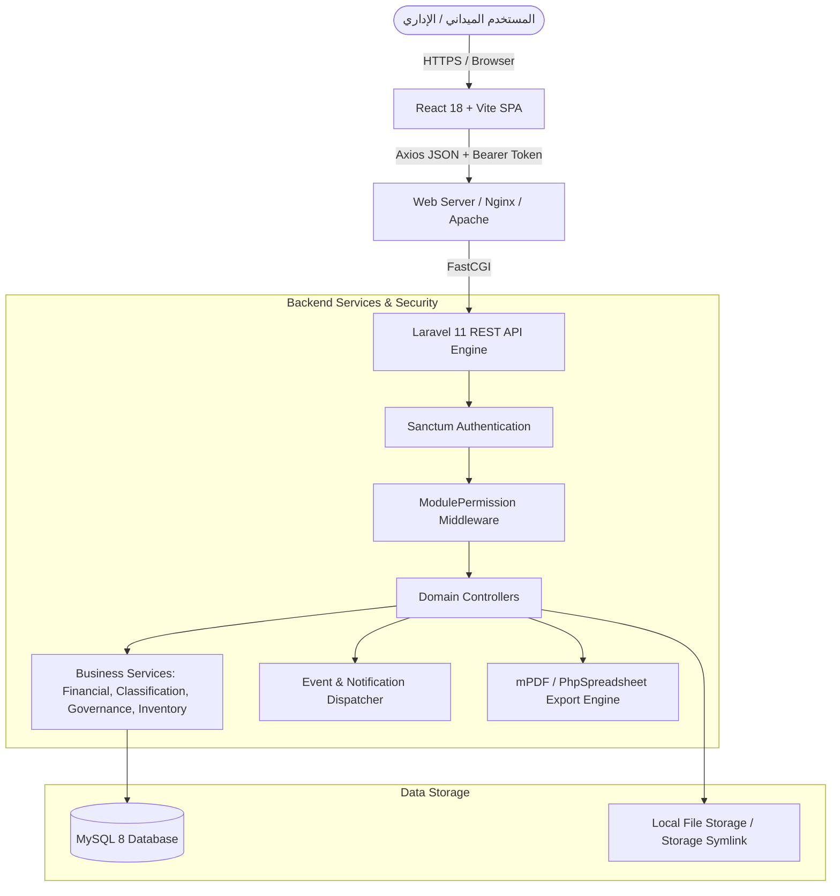
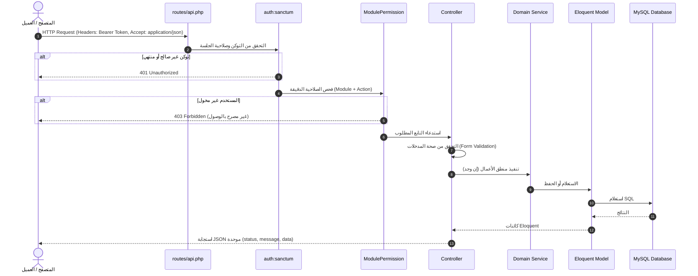

# وثيقة المعمارية العامة للنظام (System Architecture)
**مشروع:** نظام إكرام لحفظ النعمة وإدارة المستفيدين (IKRAM SYSTEM)  
**الحالة:** تدقيق معمارية الوضع الراهن (AS-IS Architecture Audit)  
**البيئة التقنية:** Laravel 11.x / PHP 8.2+ (Backend) + React 18 / Vite / TailwindCSS (Frontend SPA) + MySQL 8.x  
**التاريخ:** سبتمبر 2026

---

## 1. نظرة عامة على النظام (High-Level Overview)

نظام إكرام هو منصة رقمية متكاملة مصممة لإدارة وتوثيق عمليات توزيع الوجبات والمساعدات الغذائية والعينية، تسجيل المستفيدين (دائمين ويوميين)، إدارة جهات التمثيل ومندوبي الأحياء، متابعة موظفي الجمعية، الرقابة على المخزون والمستودعات، وتوثيق سلاسل التسليم والاستلام الميداني عبر رموز QR/كود التحقق، مع لوحات مؤشرات وحوكمة وإصدار تقارير رقابية وسندات رسمية (PDF/Excel).

---

## 2. مكدس التقنيات الفعلي (Technology Stack)

### 2.1 الواجهة الخلفية (Backend)
- **الإطار البرمجي:** Laravel Framework 11.x (يعمل على PHP 8.2+).
- **المصادقة:** Laravel Sanctum (Bearer Tokens / Personal Access Tokens).
- **قاعدة البيانات:** MySQL 8.0+ عبر Eloquent ORM.
- **توليد ملفات PDF:** حزمة `mpdf/mpdf` (v8.2) مع دعم كامل للغة العربية والخطوط المدمجة.
- **تصدير إكسل:** حزمة `phpoffice/phpspreadsheet` (v1.29).
- **المعالجة غير المتزامنة:** طوابير ومستمعي أحداث Laravel (`events/listeners`).

### 2.2 الواجهة الأمامية (Frontend)
- **المكتبة الأساسية:** React 18.2 مع حزمة Vite للتجميع والتطوير السريع.
- **التوجيه (Routing):** React Router DOM v6 مع حراسة المسارات (`Guard`).
- **التنسيق:** Tailwind CSS مع نظام تصميم مخصص لجمعية إكرام (ألوان الهوية: ذهبي `#C9A24A`، داكن `#1B2A4A`).
- **التفاعل والرسوم البيانية:** Chart.js + react-chartjs-2 + Recharts + Lucide Icons.
- **الطباعة وقراءة الرموز:** `react-to-print` و `html5-qrcode`.
- **إدارة الحالة:** React Context (`AuthContext`, `NotificationContext`).

---

## 3. طبقات البنية التحتية والتدفق (Request Lifecycle)

---

## 4. معمارية التخزين والملفات (Storage & Media Architecture)

1. **المستندات والمرفقات:**
   - ملفات هويات المستفيدين، الإثباتات، والشهادات تُخزن داخل مجلد `storage/app/public/` في مسارات مخصصة:
     - `beneficiary_documents/`
     - `daily_beneficiary_documents/`
     - `proofs/` (إثباتات تسليم المندوبين)
2. **الربط العام (Public Symlink):**
   - تم ربط `public/storage` بمجلد `storage/app/public` عبر أمر `php artisan storage:link`.
3. **توليد المستندات المؤقتة:**
   - تقارير PDF وسندات الاستلام تُولد لحظياً عبر التدفق المباشر `Inline Download` أو الحفظ المؤقت باستخدام `mpdf`.

---

## 5. نموذج التهيئة الأولية للمشروع (Bootstrap & Initialization)
- يتضمن النظام تدفقاً فريداً لمنع الوصول غير المصرح به عند تشغيل النظام لأول مرة عبر `FirstAdminSetupController`:
  - يفحص النظام جدول `system_initializations` لمعرفة ما إذا كان تم إنشاء أول مدير نظام (`first_admin`).
  - في حال لم يتم الإنشاء، يُوجّه العميل تلقائياً إلى صفحة `/setup-admin`.
  - بمجرد اكتمال الإنشاء، يُقفل المسار تماماً لمنع إنشاء حسابات مسؤولة إضافية خارج لوحة التحكم الرسمية.
