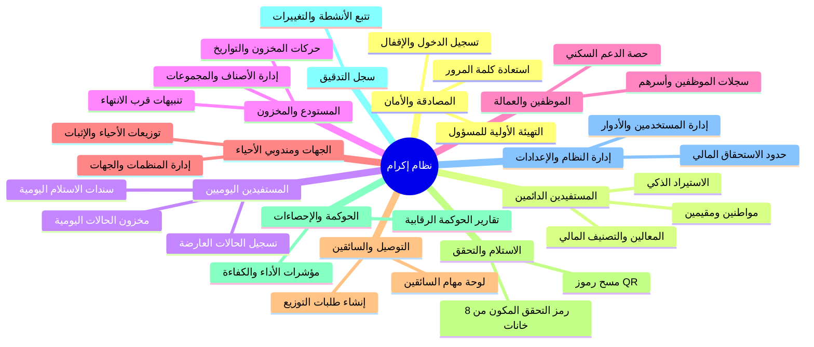

# كتالوج الوحدات الوظيفية للنظام (Module Catalog)
**مشروع:** نظام إكرام (IKRAM SYSTEM)  
**الحالة:** تدقيق معمارية الوضع الراهن (AS-IS Architecture Audit)  
**التاريخ:** سبتمبر 2026

---

## فهرس الوحدات الوظيفية (Core Functional Modules)

ينقسم نظام إكرام معمارياً ووظيفياً إلى **11 وحدة رئيسية متكاملة**:

---

## تفاصيل الوحدات الوظيفية

### 1. وحدة المصادقة والتهيئة (Authentication & Bootstrap Module)
- **المعرف في الصلاحيات:** مدمج كمسارات مفتوحة أو تحت إدارة المشرف.
- **الهدف الوظيفي:** إدارة دخول المستخدمين، منع التخمين (Rate-limiting)، حظر الحسابات المتكررة الخطأ، فرض تغيير كلمات المرور المؤقتة، واستعادة كلمة المرور عبر البريد.
- **الملفات والمكونات البرمجية:**
  - Controllers: `LoginController`, `LogoutController`, `PasswordRecoveryController`, `FirstAdminSetupController`
  - React Pages: `LoginPage.jsx`, `FirstAdminSetupPage.jsx`, `ForgotPasswordPage.jsx`, `ResetPasswordPage.jsx`, `ChangePasswordPage.jsx`

### 2. وحدة المستفيدين الدائمين (Permanent Beneficiaries Module)
- **المعرف في الصلاحيات:** `beneficiaries`
- **الهدف الوظيفي:** إدارة دورة حياة المستفيدين المعتمدين لدى الجمعية (سواء مواطنين بهوية وطنية أو مقيمين برقم إقامة)، تسجيل أفراد الأسرة (المعالين)، حساب نصيب الفرد والتصنيف المالي، وإرفاق الوثائق الرسمية.
- **الملفات والمكونات البرمجية:**
  - Controller: `Beneficiaries\BeneficiaryController`, `Beneficiaries\CategoryController`
  - Model: `Beneficiary`, `Dependent`, `BeneficiaryDocument`, `Category`
  - React Pages: `BeneficiaryList.jsx`, `AddBeneficiaryPage.jsx`, `EditBeneficiaryPage.jsx`, `BeneficiaryDetails.jsx`, `BeneficiaryImportPage.jsx`

### 3. وحدة المستفيدين اليوميين (Daily Beneficiaries Consolidated Module)
- **المعرف في الصلاحيات:** `daily_beneficiaries`
- **الهدف الوظيفي:** التعامل مع الحالات الطارئة والعابرة التي تتلقى وجبات ومساعدات فورية دون الحاجة لملف دائم، وتوثيق استلامات اليوم، ومتابعة مخزون المواد المخصصة للوجبات اليومية وحركاتها.
- **الملفات والمكونات البرمجية:**
  - Controllers: `DailyBeneficiaryController`, `DailyReceivingController`, `DailyInventoryController`
  - Models: `DailyBeneficiary`, `DailyBeneficiaryDocument`, `DailyReceivingTransaction`, `DailyInventoryItem`, `DailyInventoryMovement`
  - React Pages: `DailyBeneficiariesPage.jsx`, `DailyBeneficiaryForm.jsx`, `DailyBeneficiaryDetails.jsx`

### 4. وحدة المستودع والمخزون (Warehouse & Inventory Module)
- **المعرف في الصلاحيات:** `warehouse`
- **الهدف الوظيفي:** إدارة أرصدة المواد الغذائية والعينية، تسجيل حركات الإدخال والإخراج، مراقبة تواريخ الصلاحية وحساب المنتجات القريبة من الانتهاء (أقل من 5 أيام)، وإطلاق تنبيهات انخفاض المخزون للسلامة.
- **الملفات والمكونات البرمجية:**
  - Controller: `InventoryController` (بالإضافة إلى متحكمات سابقة مثل `Warehouse\BasketController`)
  - Models: `InventoryItem`, `InventoryMovement`, `Basket`
  - React Pages: `Warehouse.jsx`

### 5. وحدة الموظفين ومنسوبي الجمعية (Staff & Workers Module)
- **المعرف في الصلاحيات:** `staff`
- **الهدف الوظيفي:** إدارة بيانات العاملين والموظفين وسائقي الجمعية، توثيق المعالين التابعين لهم، وتتبع الحصص الغذائية المصروفة لهم بصفة دورية.
- **الملفات والمكونات البرمجية:**
  - Controller: `StaffController` (ومتحكمات مساعدة سابقة `Staff\StaffMemberController`, `Staff\StaffDistributionController`)
  - Models: `Staff`, `StaffDependent`, `StaffDistribution`, `StaffMember` (Legacy)
  - React Pages: `StaffListPage.jsx`, `AddStaffPage.jsx`, `EditStaffPage.jsx`, `StaffDetailsPage.jsx`, `StaffImportPage.jsx`

### 6. وحدة الجهات ومندوبي الأحياء (Organizations & Neighborhood Representatives)
- **المعرف في الصلاحيات:** `representatives`
- **الهدف الوظيفي:** إدارة الشراكات مع الجمعيات والمؤسسات الأخرى ومندوبي الأحياء الذين يتسلمون كميات كبيرة (وجبات/سلال) لإعادة توزيعها ميدانياً، مع توثيق إثباتات التوزيع.
- **الملفات والمكونات البرمجية:**
  - Controller: `NeighborhoodRepController` (وسابقاً `Representatives\RepDistributionController`)
  - Models: `NeighborhoodRep`, `Organization`, `RepDistribution`, `RepDistributionProof`
  - React Pages: `NeighborhoodRepsPage.jsx`

### 7. وحدة التوزيع والإرساليات (Distribution & Delivery Logistics)
- **المعرف في الصلاحيات:** `delivery`
- **الهدف الوظيفي:** جدولة الإرساليات وتعيين السائقين، تتبع خطوط السير وحالة الشحنات (معلقة، في الطريق، مكتملة)، وعرض لوحة مهام مخصصة للسائقين الميدانيين.
- **الملفات والمكونات البرمجية:**
  - Controllers: `DistributionController`, `Delivery\DeliveryOrderController`, `Delivery\DriverController`
  - Models: `Distribution`, `DeliveryOrder`, `Driver`
  - React Pages: `DeliveryPage.jsx`, `DriverDashboard.jsx`

### 8. وحدة الاستلام والتحقق الميداني (Receiver & Verification Module)
- **المعرف في الصلاحيات:** `receiver` (متاحة لجميع الأدوار للتحقق الميداني)
- **الهدف الوظيفي:** بوابة مسح رمز الاستجابة السريعة (QR Code) أو إدخال كود التحقق الأبجدي الرقمي المكون من 8 خانات، والتحقق من صحة التسليم الميداني وإتمام دورة الاستلام مع إشعار النظام.
- **الملفات والمكونات البرمجية:**
  - Controller: `ReceiverController`
  - Models: `Distribution`, `Receipt`
  - React Pages: `ReceiverPage.jsx`

### 9. وحدة الحوكمة والتحليلات (Governance, Analytics & Reporting)
- **المعرف في الصلاحيات:** `governance`
- **الهدف الوظيفي:** توفير مؤشرات رقابية وحوكمة متقدمة، حساب معدلات حفظ الطعام، تحليل التوزيع الجغرافي والسكاني، وتوليد تقارير الحوكمة الأسبوعية والنهائية بصيغ PDF وإكسل.
- **الملفات والمكونات البرمجية:**
  - Controllers: `AnalyticsController`, `PdfExportController`, `Reports\StatisticsController`
  - Services: `GovernanceReportService`
  - React Pages: `GovernancePage.jsx`, `GovernanceCharts.jsx`

### 10. وحدة سجل التدقيق والأمان (Audit & Compliance Module)
- **المعرف في الصلاحيات:** `audit` (محصورة بمدير النظام فقط)
- **الهدف الوظيفي:** تسجيل كافة العمليات الحساسة (إنشاء، تعديل، حذف، تصدير، استيراد) بالوقت والمستخدم وعنوان IP والبيانات القديمة والجديدة.
- **الملفات والمكونات البرمجية:**
  - Controller: `AuditController`
  - Model: `AuditLog`
  - React Pages: `AuditPage.jsx`

### 11. وحدة إدارة النظام والمستخدمين (Settings & Administration Module)
- **المعرف في الصلاحيات:** `settings`
- **الهدف الوظيفي:** إدارة حسابات مديري النظام، الأدوار والصلاحيات، إعدادات الحدود المالية للاستحقاق، فترات حظر كلمات المرور، وخصائص النظام العامة.
- **الملفات والمكونات البرمجية:**
  - Controllers: `UserController`, `SettingsController`
  - Models: `User`, `Setting`
  - React Pages: `Users.jsx`, `SystemSettingsPage.jsx`, `AssistantAdminDashboard.jsx`
