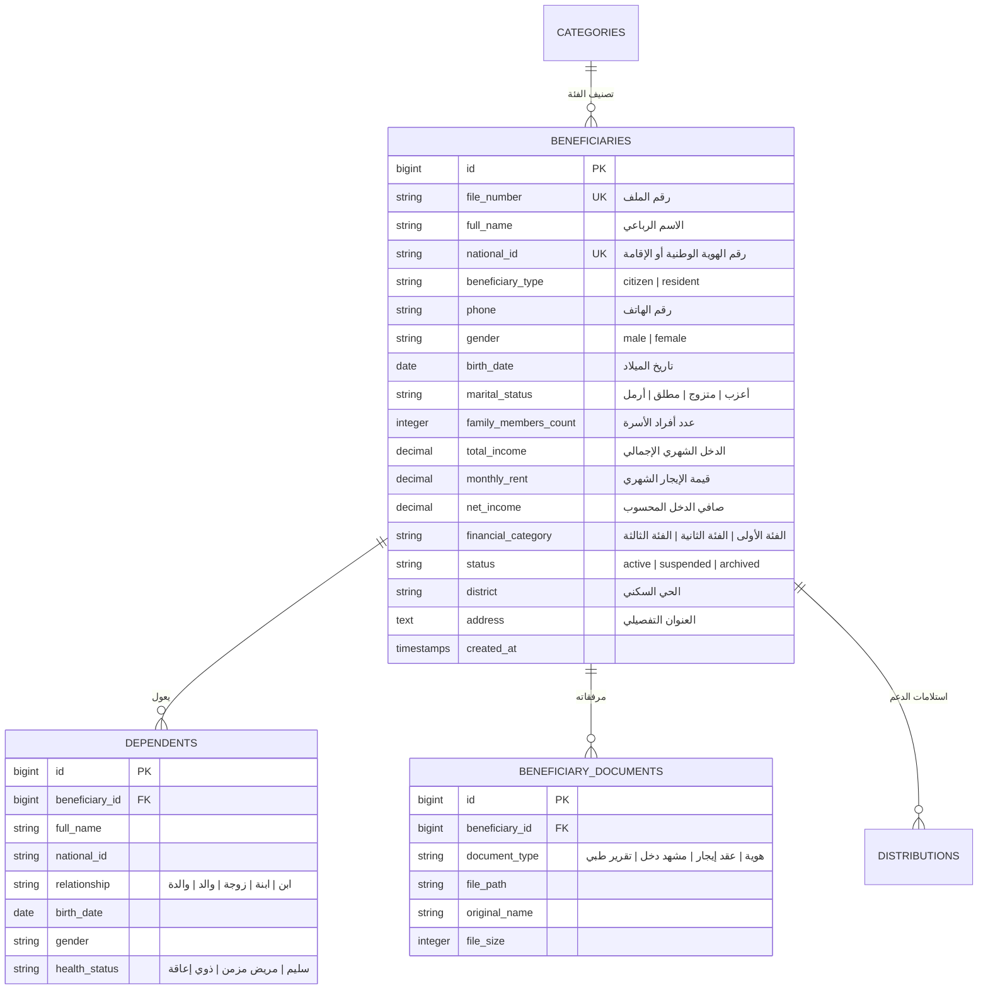
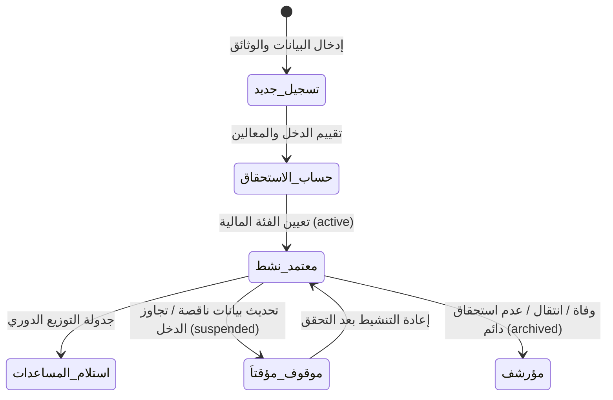

# معمارية وحدة المستفيدين الدائمين (Permanent Beneficiary Architecture)
**مشروع:** نظام إكرام (IKRAM SYSTEM)  
**الحالة:** تدقيق معمارية الوضع الراهن (AS-IS Architecture Audit)  
**الملفات المرجعية الرئيسية:**
- `app/Models/Beneficiary.php`
- `app/Models/Dependent.php`
- `app/Models/BeneficiaryDocument.php`
- `app/Http/Controllers/Beneficiaries/BeneficiaryController.php`
- `frontend/src/pages/beneficiaries/AddBeneficiaryPage.jsx`
- `frontend/src/utils/beneficiaryValidation.js`  
**التاريخ:** سبتمبر 2026

---

## 1. نموذج البيانات والعلاقات (Data Model & Schema)

---

## 2. قواعد التحقق والنزاهة (Validation Rules)

### 2.1 رقم الهوية الوطنية والإقامة:
- يتكون الحقل `national_id` من **10 أرقام بالضبط**.
- **المواطن (Citizen):** يبدأ الرقم بـ `1`.
- **المقيم (Resident):** يبدأ الرقم بـ `2`.
- تخضع الهوية لخوارزمية التحقق الرسمية (Luhn-based checksum) في الواجهة الأمامية (`beneficiaryValidation.js`) لمنع الأخطاء المطبعية قبل الإرسال.

### 2.2 الحقول الإلزامية المشتركة:
- الاسم الكامل، نوع الجنس، تاريخ الميلاد، رقم الهاتف، الحي السكني، الحالة الاجتماعية، عدد المعالين، وإجمالي الدخل الشهري.

---

## 3. دورة حياة ملف المستفيد (Beneficiary Lifecycle)

---

## 4. إطلاق الأحداث والإشعارات (Events & Notification Trigger)
- عند إنشاء مستفيد أو تعديل بياناته الأساسية أو تغيير حالته:
  - يُطلق الحدث `App\Events\BeneficiaryChanged`.
  - يستمع له `App\Listeners\SendBeneficiaryNotification`.
  - يتم إدراج إشعار في جدول `notifications` للمستخدمين الإداريين المعنيين لمتابعة أي تعديل على ملفات الحالات الدائمة.
