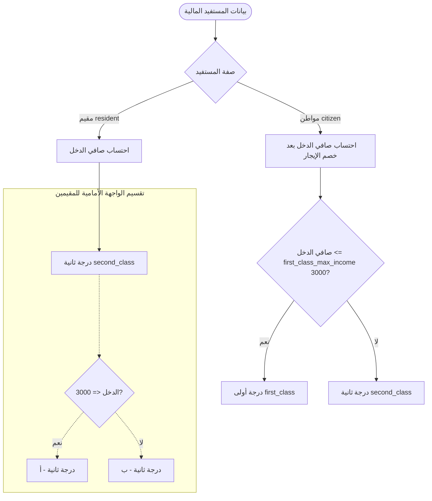

# معمارية المنطق المالي وقواعد التصنيف والاستحقاق (Financial Logic & Classification)
**مشروع:** نظام إكرام (IKRAM SYSTEM)  
**الحالة:** تدقيق معمارية الوضع الراهن (AS-IS Architecture Audit)  
**الملفات المرجعية:**
- `app/Services/FinancialCalculationService.php` (الخدمة النشطة والمستخدمة في الـ Boot والتحكم)
- `app/Services/BeneficiaryClassificationService.php` (خدمة معزولة/مهجورة لم تعد تستدعى)
- `frontend/src/utils/financialCalculations.js` (المنطق الحسابي اللحظي في الواجهة الأمامية)
- `app/Models/Beneficiary.php`
- جدول الإعدادات `settings` (`first_class_max_income`, `second_class_max_income`, `income_threshold_citizen`, `income_threshold_resident`)  
**التاريخ:** سبتمبر 2026

---

## 1. معادلات احتساب الدخل الفعلي (Income Calculation Logic)

يعتمد احتساب الدخل على صفة المستفيد (مواطن أم مقيم) ونوع السكن:

### 1.1 إجمالي الدخل (Gross Income):
- **للمواطن (Citizen):**
  $$\text{إجمالي الدخل} = \text{الراتب الشهري} + \text{معاش التقاعد} + \text{حساب المواطن} + \text{الضمان الاجتماعي} + \text{دعم الأسرة}$$
  (يتم احتساب المصدر فقط إذا تم اختياره ضمن مصفوفة `income_sources`).
- **للمقيم (Resident):**
  $$\text{إجمالي الدخل} = \text{الراتب الشهري} + \text{دعم الأسرة}$$

### 1.2 خصم الإيجار الشهري (Monthly Rent Deduction):
- إذا كان نوع السكن إيجار (`housing_type === 'rent'`):
  - إذا تم إدخال الإيجار سنوياً: $\text{الإيجار الشهري} = \frac{\text{الإيجار السنوي}}{12}$
  - أو استخدام قيمة الإيجار الشهري المباشر.
- إذا كان السكن ملكاً أو سكن خيري: $\text{الإيجار الشهري} = 0$.

### 1.3 صافي الدخل المعتمد (Net Calculated Income):
$$\text{صافي الدخل} = \max(0, \text{إجمالي الدخل} - \text{الإيجار الشهري})$$

---

## 2. قواعد تصنيف الاستحقاق (Eligibility Classification Rules)

تحدد الأولوية المالية وفق المقارنة مع حدود جدول الإعدادات `settings`:

---

## 3. التدقيق المعماري والمفارقة المكتشفة (Critical Architectural Discrepancy)

خلال التدقيق الشامل للكود المصدري، تم الكشف عن التناقض المعماري التالي:
1. **الخدمة المعتمدة في النظام:** هي `FinancialCalculationService.php` والتي يتم استدعاؤها في `Beneficiary::boot()` و `BeneficiaryController`. وتعتمد منطق **صافي الدخل** (خصم الإيجار) وحدود `first_class_max_income` (3000 ريال) و `second_class_max_income` (6000 ريال).
2. **الخدمة المعزولة:** توجد في النظام خدمة باسم `BeneficiaryClassificationService.php`، لكن عمليات البحث عبر كامل الـ Codebase أكدت أنها **غير مستدعاة مطلقاً (0 references)**، كما أنها تعتمد على منطق مغاير تماماً (إجمالي الدخل بدون خصم الإيجار، ومقارنته بالحد `income_threshold_citizen` المقدر بـ 4000 ريال).
3. **الواجهة الأمامية:** تستخدم `financialCalculations.js` الذي يطابق `FinancialCalculationService.php` في خصم الإيجار وحدود 3000/6000، ولكنه يضيف فروعاً فرعية للمقيمين (درجة ثانية أ، درجة ثانية ب) لا يتم تمثيلها بشكل منفصل في جدول الفئات `categories` في الباك إند، حيث تُربط جميعها بـ "درجة ثانية".
