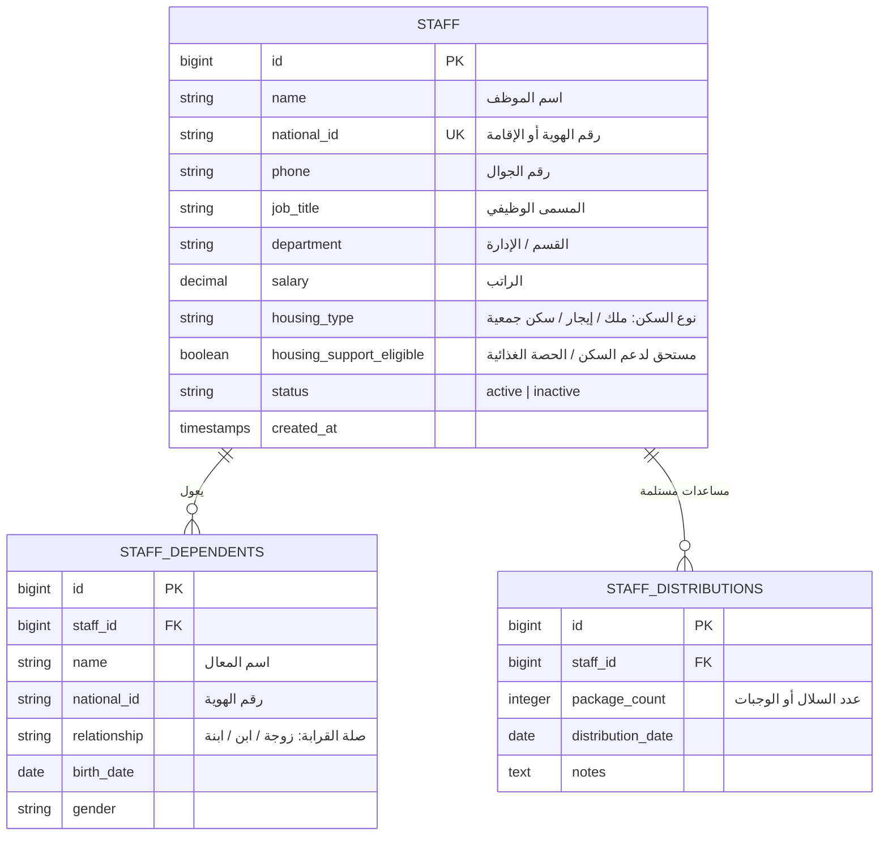

# معمارية وحدة الموظفين ومنسوبي الجمعية (Staff & Employee Architecture)
**مشروع:** نظام إكرام (IKRAM SYSTEM)  
**الحالة:** تدقيق معمارية الوضع الراهن (AS-IS Architecture Audit)  
**الملفات المرجعية:**
- `app/Models/Staff.php`
- `app/Models/StaffDependent.php`
- `app/Models/StaffDistribution.php`
- `app/Models/StaffMember.php` (Legacy Model)
- `app/Http/Controllers/StaffController.php`
- `frontend/src/pages/staff/` (`StaffListPage.jsx`, `AddStaffPage.jsx`, `StaffDetailsPage.jsx`, `StaffImportPage.jsx`)  
**التاريخ:** سبتمبر 2026

---

## 1. نموذج البيانات والعلاقات (Data Model & Schema)

---

## 2. ازدواجية الكيانات البرمجية (Staff Entity Duplication Risk)

أظهر التدقيق البرمجي وجود ازدواجية معمارية في تمثيل الموظفين:
1. **الكيان الفعال (Active Entity):**
   - الجدول: `staff`
   - الموديل: `App\Models\Staff`
   - المتحكم النشط في `routes/api.php`: `App\Http\Controllers\StaffController`
   - المسارات النشطة:
     - `GET /api/staff`
     - `POST /api/staff`
     - `GET /api/staff/{staff}`
     - `PUT /api/staff/{staff}`
     - `DELETE /api/staff/{staff}`
     - `POST /api/staff/import`
     - `POST /api/staff/{staff}/dependents`
     - `DELETE /api/staff/{staff}/dependents/{dependent}`
2. **الكيان القديم / الموازي (Legacy / Secondary Entity):**
   - الجدول: `staff_members`
   - الموديل: `App\Models\StaffMember`
   - المتحكم: `App\Http\Controllers\Staff\StaffMemberController`
   - **الملاحظة الرقابية:** لا توجد مسارات في `routes/api.php` توجه إلى `StaffMemberController` حالياً، مما يعني أن `staff_members` هو جدول legacy أو غير مستخدم في المسارات الحية.

---

## 3. الصلاحيات والتحكم بالوصول (Access Control)
- الوصول محصور حصرياً بالمدير العام ومساعد المدير:
  - فرونت إند: `allowedRoles={['admin', 'assistant_admin']}` في `App.jsx`.
  - باك إند: `ModulePermission` على وحدة `staff`.
