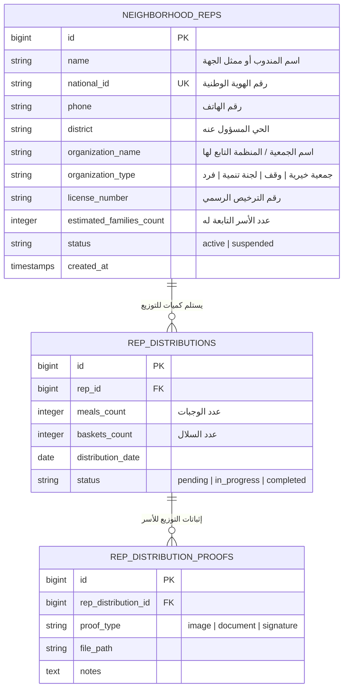
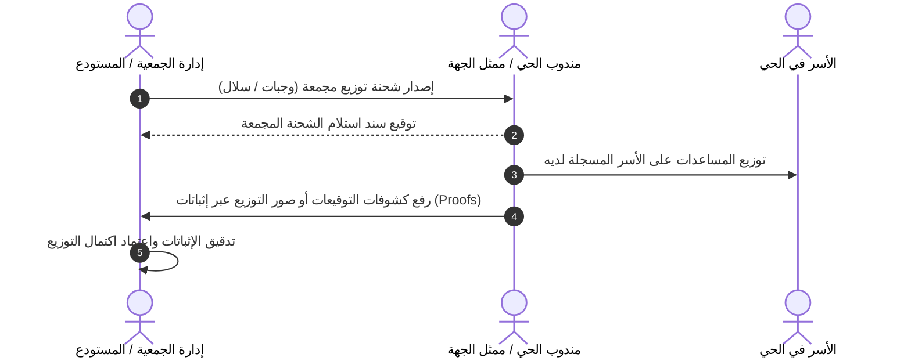

# معمارية وحدة الجهات المستفيدة ومندوبي الأحياء (Organization & Representative Architecture)
**مشروع:** نظام إكرام (IKRAM SYSTEM)  
**الحالة:** تدقيق معمارية الوضع الراهن (AS-IS Architecture Audit)  
**الملفات المرجعية:**
- `app/Models/NeighborhoodRep.php`
- `app/Models/Organization.php`
- `app/Models/RepDistribution.php`
- `app/Models/RepDistributionProof.php`
- `app/Http/Controllers/NeighborhoodRepController.php`
- `frontend/src/pages/representatives/NeighborhoodRepsPage.jsx`  
**التاريخ:** سبتمبر 2026

---

## 1. نموذج البيانات والدمج الوظيفي (Data Model & Schema Integration)

---

## 2. الملاحظات المعمارية لاندماج "الجهات" مع "المندوبين"

أثبت الفحص الشامل للواجهة والواجهة الخلفية:
1. **الواجهة الأمامية (`NeighborhoodRepsPage.jsx`):** تدمج إدارة الجهات والمندوبين في شاشة واحدة بعنوان "إدارة الجهات المستفيدة ومندوبي الأحياء".
2. **الواجهة الخلفية والـ API:** يتم توجيه طلبات الجهات والمندوبين إلى مسار `/api/representatives` الذي يديره `NeighborhoodRepController`.
3. **ازدواجية جداول الجهات:**
   - يوجد جدول وموديل مستقل باسم `Organization` (`app/Models/Organization.php`).
   - إلا أن العمليات الحية في النظام تُخزن اسم الجهة وترخيصها داخل حقول جدول `neighborhood_reps` مباشرة (`organization_name`, `organization_type`, `license_number`).

---

## 3. تدفق التوزيع الجماعي وإثبات التسليم (Bulk Distribution Workflow)

