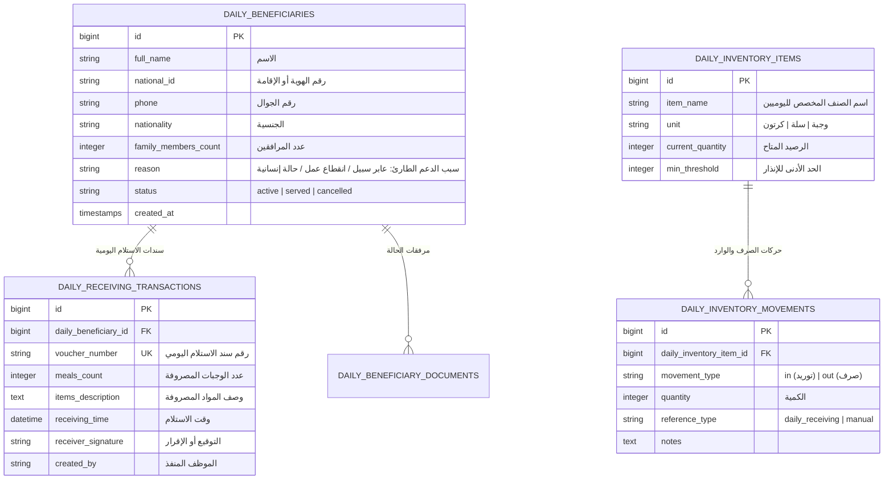

# معمارية وحدة المستفيدين اليوميين الموحدة (Daily Beneficiary Consolidated Architecture)
**مشروع:** نظام إكرام (IKRAM SYSTEM)  
**الحالة:** تدقيق معمارية الوضع الراهن (AS-IS Architecture Audit)  
**الملفات المرجعية:**
- `app/Models/DailyBeneficiary.php`
- `app/Models/DailyBeneficiaryDocument.php`
- `app/Models/DailyReceivingTransaction.php`
- `app/Models/DailyInventoryItem.php`
- `app/Models/DailyInventoryMovement.php`
- `app/Http/Controllers/DailyBeneficiaryController.php`
- `app/Http/Controllers/DailyReceivingController.php`
- `app/Http/Controllers/DailyInventoryController.php`
- `frontend/src/pages/daily-beneficiaries/DailyBeneficiariesPage.jsx`  
**التاريخ:** سبتمبر 2026

---

## 1. نموذج البيانات والعلاقات (Data Model & Schema)

---

## 2. دمج الوحدة في الواجهة الأمامية (Frontend Consolidation)

تم دمج المسارات الثلاثة المعنية بالحالات اليومية في شاشة واحدة موحدة لتسهيل العمل الميداني:
- المسارات القديمة المحولة في `App.jsx`:
  - `/daily-beneficiaries/receiving` $\rightarrow$ يُوجّه إلى `/daily-beneficiaries?tab=deliveries`.
  - `/daily-beneficiaries/inventory` $\rightarrow$ يُوجّه إلى `/daily-beneficiaries?tab=inventory`.
- التبويبات الثلاثة النشطة في `DailyBeneficiariesPage.jsx`:
  1. **سجل المستفيدين اليوميين:** إدارة بيانات المستفيدين العابرين والحالات الطارئة.
  2. **سندات الاستلام اليومية:** توثيق تسليم الوجبات اليومية واستخراج وطباعة سند الاستلام بصيغة PDF.
  3. **مخزون الحالات اليومية:** تتبع الوجبات والمواد الجاهزة المخصصة للصرف اليومي الفوري منفصلة عن مستودع السلال التموينية الدائمة.

---

## 3. إصدار سندات الاستلام والطباعة (Voucher PDF Generation)
- يوفر النظام مساراً مخصصاً لطباعة سند الاستلام اليومي:
  - المسار: `GET /api/daily-beneficiaries/receiving/{id}/pdf`
  - المتحكم: `PdfExportController@exportDailyReceivingVoucher`
  - المعيار الرقابي: يتضمن السند اسم المستفيد، رقم هويته، عدد الوجبات، وتوقيع المستلم وختم الجمعية مع رمز تحقق فوري.
