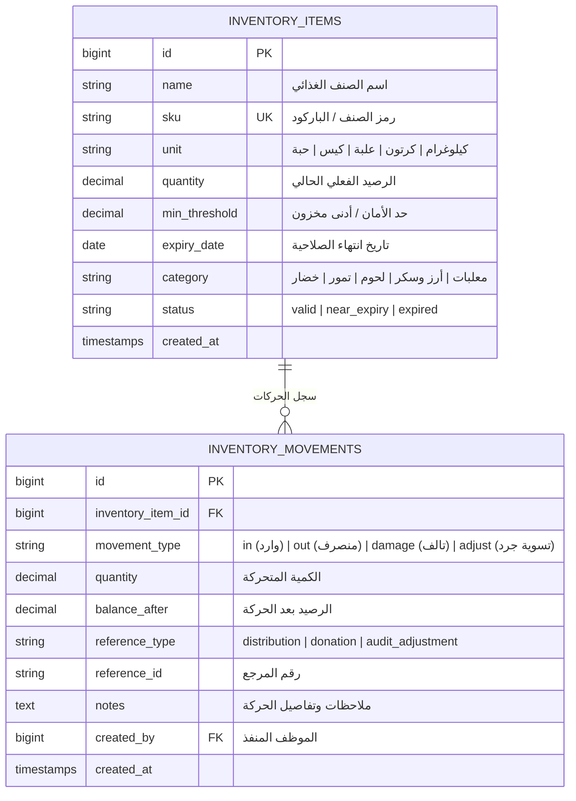

# معمارية وحدة المستودع والمخزون والرقابة على الصلاحية (Warehouse & Inventory Architecture)
**مشروع:** نظام إكرام (IKRAM SYSTEM)  
**الحالة:** تدقيق معمارية الوضع الراهن (AS-IS Architecture Audit)  
**الملفات المرجعية:**
- `app/Models/InventoryItem.php`
- `app/Models/InventoryMovement.php`
- `app/Services/InventoryAlertService.php`
- `app/Http/Controllers/InventoryController.php`
- `frontend/src/pages/warehouse/Warehouse.jsx`  
**التاريخ:** سبتمبر 2026

---

## 1. نموذج البيانات وحركات المخزون (Data Model & Movements)

---

## 2. قواعد تتبع الصلاحية وتنبيهات الأمان (Expiry & Safety Stock Rules)

### 2.1 قاعدة المنتجات قريبة الانتهاء (5-Day Near Expiry Rule):
- يتم فحص تواريخ الصلاحية آلياً في الباك إند والفرونت إند:
  - إذا كان $\text{expiry\_date} < \text{اليوم الحالي}$: تصبح الحالة **منتهي الصلاحية (Expired)**.
  - إذا كان $\text{اليوم الحالي} \le \text{expiry\_date} \le \text{اليوم الحالي} + 5 \text{ أيام}$: تصبح الحالة **قريب الانتهاء (Near Expiry)**، ويتم إطلاق إشعار عاجل لمسؤولي المستودع والإدارة لمنع هدر الأغذية وتوجيهها للصرف الفوري.
  - إذا كان $\text{expiry\_date} > \text{اليوم الحالي} + 5 \text{ أيام}$: تصبح الحالة **صالح (Valid)**.

### 2.2 قاعدة حد الأمان للمخزون (Safety Minimum Stock):
- عند إجراء أي حركة صرف (`movement_type = out`):
  - يتم التحقق من الرصيد الجديد: إذا كان $\text{quantity} \le \text{min\_threshold}$، يتم إطلاق إشعار بنوع `stock_low` لتنبيه مسؤولي المشتريات بالطلب المبكر.

---

## 3. التكامل مع عمليات التوزيع (Integration with Distribution)
- عند إنشاء إرسالية توزيع (`Distribution`)، يتم خصم الكميات من المستودع تلقائياً، وتوثيق ذلك بحركة نوعها `out` مرتبطة برقم الإرسالية لمنع حدوث فروقات جردية بين السجلات الدفترية والأرصدة الفعلية على الأرفف.
