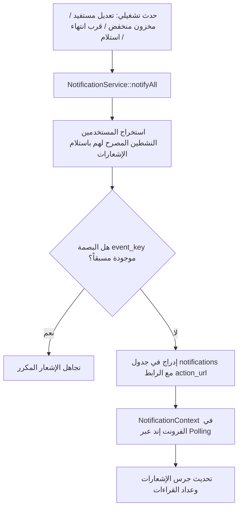

# معمارية نظام الإشعارات والتنبيهات التشغيلية (Notification Architecture)

> **تحديث 2026-09-24:** قناة WhatsApp متقاعدة؛ تكليف السائق والرابط المؤقت عبر SMS وفق [ADR-007](ADR-007-WHATSAPP-RETIREMENT-DRIVER-SMS.md). إشارات WhatsApp أدناه تاريخية فقط.

> تنبيه مرجعي — 2026-09-20: هذه وثيقة AS-IS تصف الكود الحالي، ولا تعتمد QR أو طرق الاتصال الحالية للـ TO-BE. القرارات المستقبلية الملزمة في [TO_BE_MASTER_DESIGN.md](TO_BE_MASTER_DESIGN.md) و[ADR-005](ADR-005-COMMUNICATION-DELIVERY-DEPLOYMENT.md): تحقق بأربعة أرقام فقط، SMS للمستلمين، WhatsApp Business للسائق، Email للاستعادة، وTaqnyat مستقبلًا. لا يتغير الكود الحالي بهذا التوثيق.

**مشروع:** نظام إكرام (IKRAM SYSTEM)  
**الحالة:** تدقيق معمارية الوضع الراهن (AS-IS Architecture Audit)  
**الملفات المرجعية:**
- `app/Models/Notification.php`
- `app/Services/NotificationService.php`
- `app/Http/Controllers/NotificationController.php`
- `frontend/src/context/NotificationContext.jsx`  
**التاريخ:** سبتمبر 2026

---

## 1. فلسفة ومعمارية الإشعارات (Notification Philosophy & Design)

يعتمد نظام إكرام على معمارية إشعارات تشغيلية مركزية داخل قاعدة البيانات (`Database Notifications`):
1. **استهداف الأدوار والصلاحيات:** لا يتم إرسال الإشعارات عشوائياً، بل تمر عبر محرك فلترة يطابق الصلاحيات الدقيقة للمستخدم (`permissions[module]['notifications']`).
2. **منع التكرار (Deduplication via Event Key):** يتم توليد بصمة تجزئة SHA-256 فريدة لكل حدث بناءً على (`recipient_id + type + model_id + model_version + message`) عبر `firstOrCreate` لمنع إغراق المستخدمين بإشعارات مكررة لنفس الحالة.
3. **التحديث اللحظي (Polling & Reactive Context):** في الواجهة الأمامية، يقوم `NotificationContext.jsx` بطلب التحديث الدوري وتخزين الإشعارات غير المقروءة وعداد التنبيهات في شريط الملاحة العلوي.

---

## 2. هيكل جدول الإشعارات (Notifications Schema)

| الحقل | النوع | الوصف |
|---|---|---|
| `id` | `char(36)` / UUID | المعرف الفريد للإشعار |
| `event_key` | `string` UK | بصمة التجزئة SHA-256 لمنع التكرار |
| `recipient_type` | `string` | نوع المستلم (`staff` أو `user`) |
| `recipient_id` | `unsignedBigInteger` | معرف المستخدم المستلم |
| `related_record_type`| `string` | الفئة المرتبطة (`Beneficiary`, `InventoryItem`, `Distribution`, إلخ) |
| `related_record_id` | `string` | معرف السجل المرتبط |
| `title` | `string` | عنوان الإشعار التوجيهي (مثل: تنبيه المستودع، تحديث المستفيدين) |
| `message_body` | `text` | نص رسالة الإشعار التفصيلية |
| `action_url` | `string` | رابط التحويل المباشر في واجهة React عند الضغط على الإشعار |
| `category` | `string` | تصنيف الإشعار (`warehouse_expiry`, `security`, `system_event`) |
| `status` | `string` | حالة الإشعار (`sent`, `read`, `archived`) |
| `sent_at` | `timestamp` | وقت الإرسال |
| `read_at` | `timestamp` | وقت القراءة والاطلاع |

---

## 3. نقاط الوصول الخاصة بالإشعارات (Notification Endpoints)
- `GET /api/notifications` $\rightarrow$ استرجاع قائمة الإشعارات وقائمة غير المقروءة.
- `POST /api/notifications/{id}/read` $\rightarrow$ تحديد إشعار معين كمقروء.
- `POST /api/notifications/read-all` $\rightarrow$ تحديد جميع الإشعارات كمقروءة للمستخدم الحالي.
- `POST /api/users/{id}/toggle-notifications` $\rightarrow$ تفعيل أو إيقاف استلام الإشعارات لمستخدم محدد من قبل الإدارة.
