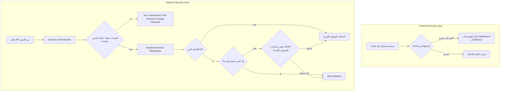

# معمارية الصلاحيات والتحكم في الوصول (Authorization & RBAC Architecture)
**مشروع:** نظام إكرام (IKRAM SYSTEM)  
**الحالة:** تدقيق معمارية الوضع الراهن (AS-IS Architecture Audit)  
**الملفات المرجعية:**
- `app/Http/Middleware/ModulePermission.php`
- `app/Http/Middleware/RoleMiddleware.php`
- `app/Models/User.php`
- `frontend/src/App.jsx` (مكون `Guard`)
- `frontend/src/components/Sidebar.jsx`  
**التاريخ:** سبتمبر 2026

---

## 1. نموذج التحكم الثنائي بالوصول (Dual-Layer Authorization Architecture)

يعتمد نظام إكرام على نموذج حماية ثنائي الطبقات لضمان عدم إمكانية تجاوز الصلاحيات عبر التلاعب بالواجهة الأمامية أو استدعاء الـ API مباشرة:

---

## 2. الأدوار المعتمدة في النظام (System Roles)

يحتوي النظام على **8 أدوار رسمية** مخزنة في حقل `users.role`:
1. **`admin` (مدير النظام / المشرف العام):** يمتلك كامل الصلاحيات دون استثناء ويتجاوز كافة قيود الفحص.
2. **`assistant_admin` (المساعد الإداري):** يدير معظم العمليات والتقارير والموظفين ولكن يُحجب عنه إدارة المستخدمين والإعدادات وسجل التدقيق.
3. **`reception` (موظف الاستقبال):** تسجيل واستعراض المستفيدين الدائمين واليوميين وإصدار سندات الاستلام الفورية.
4. **`staff` (موظف الجمعية / العمليات):** إدارة المستفيدين، المستودع، التوصيل، والجهات.
5. **`warehouse` (أمين المستودع):** إدارة المخزون، الأصناف، حركات الوارد والمنصرف، وتنبيهات الصلاحية.
6. **`delivery_driver` / `driver` (سائق التوصيل):** مهام التوصيل، استعراض الشحنات المخصصة له، والتحقق عبر بوابة الاستلام.
7. **`readonly` (مشاهد / قراءة فقط):** استعراض البيانات والتقارير والإحصائيات دون أي إمكانية للإضافة أو التعديل أو الحذف أو التصدير التغييري.

---

## 3. محرك تحليل المسارات والإجراءات (`ModulePermission.php`)

يقوم الوسيط `ModulePermission` بتحليل عنوان الطلب HTTP URL وطريقته وتعيينها تلقائياً:
- **الوحدات المحللة (10 وحدات):**
  - `beneficiaries`, `daily_beneficiaries`, `warehouse`, `staff`, `representatives`, `delivery`, `receiver`, `governance`, `audit`, `settings`.
- **الإجراءات المحللة (7 إجراءات):**
  - `view`: طلبات `GET`.
  - `create`: طلبات `POST`.
  - `edit`: طلبات `PUT`, `PATCH`, أو مسارات الحالة (`confirm`, `dispatch`, `adjust`, `status`, `whatsapp`).
  - `delete`: طلبات `DELETE`.
  - `import`: المسارات المتضمنة `/import` أو `smart-import`.
  - `export`: المسارات المتضمنة `export` أو `/excel`.
  - `issue_document`: مسارات طباعة السندات والوثائق `/documents/`.
