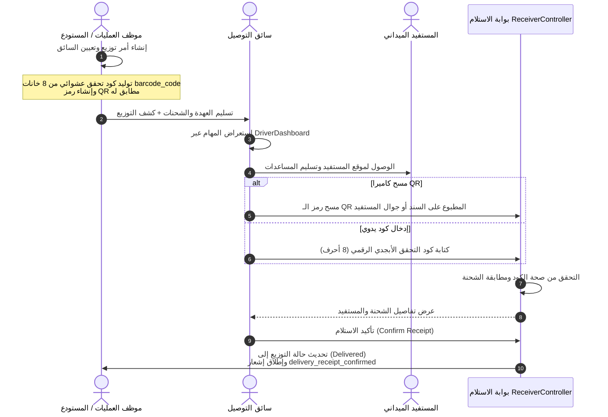

# معمارية وحدة السائقين والتوصيل والتحقق الميداني (Driver, Delivery & Receiver Architecture)

> **تحديث 2026-09-24:** قناة WhatsApp متقاعدة؛ تكليف السائق والرابط المؤقت عبر SMS وفق [ADR-007](ADR-007-WHATSAPP-RETIREMENT-DRIVER-SMS.md). إشارات WhatsApp أدناه تاريخية فقط.

> تنبيه مرجعي — 2026-09-20: هذه وثيقة AS-IS تصف الكود الحالي، ولا تعتمد QR أو طرق الاتصال الحالية للـ TO-BE. القرارات المستقبلية الملزمة في [TO_BE_MASTER_DESIGN.md](TO_BE_MASTER_DESIGN.md) و[ADR-005](ADR-005-COMMUNICATION-DELIVERY-DEPLOYMENT.md): تحقق بأربعة أرقام فقط، SMS للمستلمين، WhatsApp Business للسائق، Email للاستعادة، وTaqnyat مستقبلًا. لا يتغير الكود الحالي بهذا التوثيق.

**مشروع:** نظام إكرام (IKRAM SYSTEM)  
**الحالة:** تدقيق معمارية الوضع الراهن (AS-IS Architecture Audit)  
**الملفات المرجعية:**
- `app/Models/Driver.php`
- `app/Models/Distribution.php`
- `app/Models/DeliveryOrder.php`
- `app/Http/Controllers/DistributionController.php`
- `app/Http/Controllers/ReceiverController.php`
- `frontend/src/pages/delivery/DeliveryPage.jsx`
- `frontend/src/pages/delivery/DriverDashboard.jsx`
- `frontend/src/pages/receiver/ReceiverPage.jsx`  
**التاريخ:** سبتمبر 2026

---

## 1. دورة حياة أمر التوزيع والتسليم (Delivery Workflow)

---

## 2. مواصفات كود التحقق ورمز QR (Verification Code & QR Specifications)

1. **كود التحقق الفريد (`barcode_code`):**
   - يتولد تلقائياً عند حفظ كائن `Distribution` عبر استدعاء:
     `strtoupper(Str::random(8))`
   - يتكون من 8 أحرف وأرقام إنجليزية كبيرة خالية من التعقيد (مثال: `A7K9M2X4`).
2. **رمز الاستجابة السريعة (QR Code):**
   - يحمل النص المباشر لكود التحقق أو رابط الاستلام.
   - تتم قراءته عبر كاميرا المتصفح مباشرة في `ReceiverPage.jsx` باستخدام مكتبة `html5-qrcode`، أو إدخاله يدوياً في حقل مخصص لمن لا يمتلك كاميرا أو في حال تعذر القراءة الضوئية.
3. **التوثيق الرقابي:**
   - يمنع النظام إعادة تأكيد نفس الكود مرتين، حيث يتم فحص حالة السجل، وتتحول حالته من `pending` / `in_progress` إلى `delivered` مع تسجيل التوقيت الدقيق وهوية المستخدم الذي أجرى عملية التأكيد.
