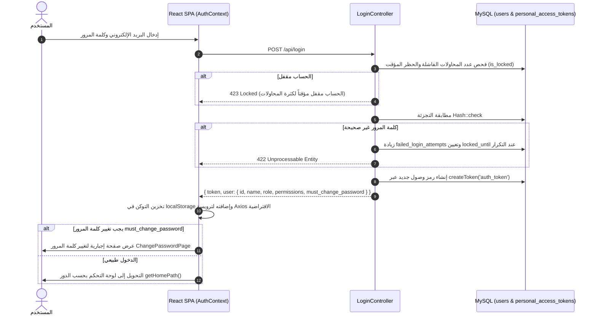

# معمارية المصادقة وحماية الجلسات والأمان (Authentication & Security Architecture)

> **تحديث 2026-09-24:** قناة WhatsApp متقاعدة؛ تكليف السائق والرابط المؤقت عبر SMS وفق [ADR-007](ADR-007-WHATSAPP-RETIREMENT-DRIVER-SMS.md). إشارات WhatsApp أدناه تاريخية فقط.

> تنبيه مرجعي — 2026-09-20: هذه وثيقة AS-IS تصف الكود الحالي، ولا تعتمد QR أو طرق الاتصال الحالية للـ TO-BE. القرارات المستقبلية الملزمة في [TO_BE_MASTER_DESIGN.md](TO_BE_MASTER_DESIGN.md) و[ADR-005](ADR-005-COMMUNICATION-DELIVERY-DEPLOYMENT.md): تحقق بأربعة أرقام فقط، SMS للمستلمين، WhatsApp Business للسائق، Email للاستعادة، وTaqnyat مستقبلًا. لا يتغير الكود الحالي بهذا التوثيق.

**مشروع:** نظام إكرام (IKRAM SYSTEM)  
**الحالة:** تدقيق معمارية الوضع الراهن (AS-IS Architecture Audit)  
**الملفات المرجعية:**
- `app/Http/Controllers/Auth/LoginController.php`
- `app/Http/Controllers/Auth/LogoutController.php`
- `app/Http/Controllers/Auth/PasswordRecoveryController.php`
- `app/Http/Controllers/Auth/FirstAdminSetupController.php`
- `app/Models/User.php`
- `app/Http/Middleware/ModulePermission.php`
- `frontend/src/context/AuthContext.jsx`  
**التاريخ:** سبتمبر 2026

---

## 1. نموذج المصادقة وإدارة الرموز (Sanctum Token Authentication)

يعتمد النظام على **Laravel Sanctum** لإصدار رموز الوصول الشخصية (Personal Access Tokens / Bearer Tokens):

---

## 2. إدارة كلمات المرور المؤقتة والإقفال الأمني (Temporary Password & Lockout Policy)

1. **إجبارية تغيير كلمة المرور المؤقتة:**
   - يمتلك جدول `users` حقلين: `must_change_password` (boolean) و `temporary_password_expires_at` (timestamp).
   - عند إنشاء مستخدم جديد عبر الإدارة، تُعين له كلمة مرور مؤقتة ويوضع الحقل `must_change_password = true`.
   - يمنع الوسيط `ModulePermission` وصول هذا المستخدم لأي نقطة نهاية في النظام باستثناء:
     - `GET /api/me`
     - `POST /api/logout`
     - `POST /api/change-password`
     ويعيد الكود: `PASSWORD_CHANGE_REQUIRED` برمز `403 Forbidden`.
2. **سياسة منع التخمين والإقفال (Brute-Force Protection):**
   - يتم احتساب المحاولات الفاشلة في حقل `failed_login_attempts`.
   - عند تجاوز الحد الأقصى، يُقفل الحساب بتعيين وقت في حقل `locked_until` وتفعيل `is_locked = true`.
   - يخضع مسار الدخول المحدد في `routes/api.php` لخنق الطلبات بمعدل `throttle:6,1` (6 محاولات بالدقيقة).

---

## 3. آلية حماية التهيئة الأولى للمشروع (Bootstrap Zero-Trust Setup)
- تدير وحدة `FirstAdminSetupController` مرحلة التشغيل الأولى للنظام:
  - يتم فحص جدول `system_initializations` للبحث عن المفتاح `first_admin`.
  - في حال عدم وجود المشرف، يسمح النظام بطلب `POST /api/setup-admin` لإنشاء المدير العام الأول.
  - تتم العملية داخل معاملة قاعدة بيانات مع قفل الصف (`lockForUpdate`) لمنع هجمات التزامن (Race Conditions).
  - بعد اكتمال الإنشاء، يُكتب قفل نهائي في الجدول، ويتم حظر أي طلبات مستقبلية برمز `403 Setup Already Completed`.
