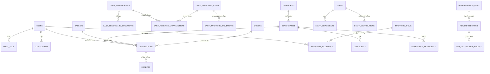

# مخطط الكيانات والعلاقات لقاعدة البيانات (Database ERD & Schema Catalog)
**مشروع:** نظام إكرام (IKRAM SYSTEM)  
**الحالة:** تدقيق معمارية الوضع الراهن (AS-IS Architecture Audit)  
**محرك قاعدة البيانات:** MySQL 8.x / Eloquent ORM  
**التاريخ:** سبتمبر 2026

---

## 1. المخطط الشامل للكيانات والعلاقات (Comprehensive ERD)

---

## 2. كتالوج الجداول الأساسية في قاعدة البيانات (Core Tables Catalog)

| اسم الجدول (Table Name) | النموذج المقابل (Model) | الوصف الوظيفي والرقابي |
|---|---|---|
| `users` | `User` | حسابات المستخدمين، الأدوار، الصلاحيات JSON، وسياسات القفل وتغيير كلمة المرور. |
| `system_initializations` | - | جدول التهيئة الأولية لمنع تكرار مسار إعداد المدير العام الأول `first_admin`. |
| `settings` | `Setting` | جدول مفاتيح الإعدادات وحدود الاستحقاق المالي وساعات العمل. |
| `audit_logs` | `AuditLog` | سجل التدقيق والامتثال الأمني (العمليات، المعرفات، البيانات السابقة واللاحقة، عنوان IP). |
| `notifications` | `Notification` | سجل الإشعارات التشغيلية الموجهة بصمة التجزئة `event_key` وحالة القراءة. |
| `categories` | `Category` | فئات الاستحقاق (درجة أولى، درجة ثانية، ذوي الاحتياجات الخاصة، كبار السن). |
| `beneficiaries` | `Beneficiary` | السجل المدني والمالي للمستفيدين الدائمين (مواطنين ومقيمين). |
| `dependents` | `Dependent` | أفراد أسر المستفيدين الدائمين وصلات القرابة وحالاتهم الصحية. |
| `beneficiary_documents` | `BeneficiaryDocument` | مسارات الوثائق والمستندات الرسمية المرفوعة للمستفيدين الدائمين. |
| `daily_beneficiaries` | `DailyBeneficiary` | سجل الحالات الطارئة والمستفيدين اليوميين وعابري السبيل. |
| `daily_beneficiary_documents` | `DailyBeneficiaryDocument` | إثباتات ومرفقات الحالات اليومية. |
| `daily_receiving_transactions`| `DailyReceivingTransaction` | سندات الصرف والاستلام الفوري للوجبات اليومية. |
| `daily_inventory_items` | `DailyInventoryItem` | أصناف مخزون الوجبات والمواد المخصصة للصرف اليومي العاجل. |
| `daily_inventory_movements` | `DailyInventoryMovement` | حركات الوارد والمنصرف لمخزون الوجبات اليومية. |
| `inventory_items` | `InventoryItem` | أصناف المستودع العام، أرصدة الكميات، وحدود الأمان، وتواريخ الصلاحية. |
| `inventory_movements` | `InventoryMovement` | حركات المستودع العام (وارد، منصرف، تالف، تسوية جرد). |
| `baskets` | `Basket` | تعريف نماذج السلال الغذائية ومكوناتها المجمعة. |
| `staff` | `Staff` | سجل موظفي الجمعية، الرواتب، ونوع السكن واستحقاق الدعم. |
| `staff_members` | `StaffMember` | جدول قديم (Legacy) لمنسوبي الجمعية غير مستخدم في المسارات النشطة. |
| `staff_dependents` | `StaffDependent` | أسر ومعالو موظفي الجمعية. |
| `staff_distributions` | `StaffDistribution` | سجل الحصص والمساعدات المصروفة لموظفي الجمعية. |
| `neighborhood_reps` | `NeighborhoodRep` | مندوبو الأحياء وممثلو الجهات الشريكة، متضمناً بيانات التراخيص والمنظمات. |
| `organizations` | `Organization` | جدول مستقل للجهات الشريكة (يوجد تداخل مع جدول مندوبي الأحياء). |
| `rep_distributions` | `RepDistribution` | الإرساليات والكميات المجمعة الموجهة للمندوبين والجهات. |
| `rep_distribution_proofs` | `RepDistributionProof` | الصور والمستندات المرفوعة لإثبات تسليم الكميات للأسر المستفيدة. |
| `drivers` | `Driver` | بيانات سائقي الجمعية، أرقام الرخص ولوحات المركبات. |
| `distributions` | `Distribution` | أوامر التوزيع الميداني، كود التحقق 8 خانات، تاريخ الجدولة، وحالة التسليم. |
| `delivery_orders` | `DeliveryOrder` | سجل فرعي لطلبات التوصيل وجدولتها. |
| `receipts` | `Receipt` | سندات استلام التوزيع الميداني بعد التحقق. |
