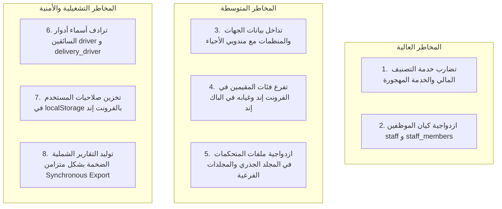

# مصفوفة المخاطر المعمارية والديون التقنية (Architecture Risks & Technical Debt)
**مشروع:** نظام إكرام (IKRAM SYSTEM)  
**الحالة:** تدقيق معمارية الوضع الراهن (AS-IS Architecture Audit)  
**التاريخ:** سبتمبر 2026

---

## 1. ملخص المخاطر المكتشفة (Executive Risk Summary)

خلال التدقيق الشامل للكود المصدري وقاعدة البيانات، تم رصد **8 مخاطر معمارية وتناقضات كودية** تستوجب التوثيق والحذر عند أي تطويرات مستقبلية:

---

## 2. التحليل التفصيلي للمخاطر المعمارية (Detailed Risk Catalog)

### الخطر 1: وجود خدمة تصنيف استحقاق مهجورة ومتناقضة (High Risk)
- **الوصف:** وجود `App\Services\BeneficiaryClassificationService.php` في الكود، وهي خدمة **غير مستدعاة مطلقاً (0 references)**.
- **التناقض الفني:** تعتمد هذه الخدمة على إجمالي الدخل دون خصم الإيجار ومقارنته بالحد 4000 ريال، بينما الخدمة النشطة `FinancialCalculationService.php` تعتمد صافي الدخل بعد خصم الإيجار مع حدود 3000 و 6000 ريال.
- **الأثر:** خطر استدعاء هذه الخدمة بالخطأ مستقبلاً من قبل مطور آخر مما يؤدي إلى تغيير تصنيفات المستفيدين وظلم حالات مستحقة.

---

### الخطر 2: ازدواجية كيان وجدول الموظفين (High Risk)
- **الوصف:** وجود جدولين وموديلين للموظفين في قاعدة البيانات:
  - `staff` والموديل المقابل `App\Models\Staff` والمتحكم الفعال `StaffController.php`.
  - `staff_members` والموديل المقابل `App\Models\StaffMember` والمتحكم المعزول `Staff\StaffMemberController.php`.
- **الأثر:** بقاء جداول قديمة ومتحكمات غير موجهة يربك تقارير الحوكمة ويزيد من عبء صيانة قاعدة البيانات.

---

### الخطر 3: التداخل المعماري بين "الجهات" و "مندوبي الأحياء" (Medium Risk)
- **الوصف:** وجود جدول وموديل مستقل باسم `Organization`، بينما الشاشة الحية في الفرونت إند وعمليات الـ API في الباك إند تعمل بالكامل على جدول `neighborhood_reps` الذي أضيفت إليه حقول المنظمة (`organization_name`, `license_number`, `organization_type`).
- **الأثر:** غموض في نمذجة العلاقات؛ هل المندوب يتبع المنظمة، أم أن المندوب هو نفسه المنظمة؟

---

### الخطر 4: تفرع فئات استحقاق المقيمين في الفرونت إند وغيابه في الباك إند (Medium Risk)
- **الوصف:** تقوم ملفات الواجهة الأمامية (`financialCalculations.js`) بتقسيم المقيمين إلى "درجة ثانية - أ" و "درجة ثانية - ب"، ولكن في الباك إند وجدول الفئات `categories` يتم حفظهم جميعاً تحت معرف الفئة "درجة ثانية" فقط.
- **الأثر:** قد يرى الموظف في شاشة التسجيل درجة فرعية لا تنعكس في التقارير الرسمية أو كشوفات الصرف في قاعدة البيانات.

---

### الخطر 5: ازدواجية مسارات المتحكمات في المجلد الجذري والمجلدات الفرعية (Medium Risk)
- **الوصف:** وجود نسختين من ملفات المتحكمات في المشروع:
  - نسخة في `app/Http/Controllers/` (وهي النسخة النشطة المستوردة في `routes/api.php`).
  - نسخة أخرى في مجلدات فرعية مثل `app/Http/Controllers/Distributions/`, `Representatives/`, `Admin/`.
- **الأثر:** خطر قيام أي مطور مستقبلي بتعديل الملف في المجلد الفرعي دون أن يعلم أن الـ Router يستورد الملف الجذري.

---

### الخطر 6: تعدد مسميات أدوار السائقين (`driver` مقابل `delivery_driver`) (Low/Medium Risk)
- **الوصف:** يقبل النظام الاسمين `driver` و `delivery_driver` في كل من `App.jsx` و `ModulePermission.php`.
- **الأثر:** تشتت في التحقق من الأدوار، وخطر نسيان أحد الاسمين عند إضافة نقطة نهاية جديدة مما قد يسبب تسرب صلاحية أو حجب غير مبرر.

---

### الخطر 7: تخزين الصلاحيات في `localStorage` بالمتصفح (Security Note)
- **الوصف:** يتم تخزين كائن المستخدم وصلاحياته `user.permissions` في `localStorage` للمتصفح لدعم العرض اللحظي للواجهة بدون انتظار.
- **التخفيف الحالي:** قام الباك إند بحماية كافة المسارات الحساسة عبر وسيط `ModulePermission`، وبالتالي حتى لو تلاعب العميل بذاكرة المتصفح ليظهر زراً محمياً، فإن الضغط عليه سيعيد فوراً `403 Forbidden` من خادم Laravel.

---

### الخطر 8: التوليد المتزامن للتقارير الشاملة الضخمة (Performance Risk)
- **الوصف:** يتم توليد ملفات PDF المعقدة وتصدير الإكسل الشامل في `PdfExportController` بشكل متزامن (Synchronous Request) داخل دورة الطلب HTTP العادية.
- **الأثر:** مع نمو سجلات المستفيدين والتوزيعات إلى عشرات الآلاف، قد يتجاوز وقت المعالجة حد الخادم `max_execution_time` (30-60 ثانية) مما يسبب خطأ `504 Gateway Timeout`.
