# خريطة الكود النشط والمتحكمات (ACTIVE CODE MAP)
**مشروع:** نظام إكرام (IKRAM SYSTEM)  
**الحالة:** تدقيق المسارات والمتحكمات النشطة والقديمة (Active vs Legacy Controller Map)  
**التاريخ:** سبتمبر 2026

---

## 1. الغرض والأهمية (Purpose)

تم إعداد هذا الدليل لمنع تكرار خطأ تعديل ملفات برمجية معزولة أو مهجورة يعتقد المطور أنها نشطة بينما مسارات Laravel تستورد وتنفذ ملفاً آخر تماماً في مجلد مختلف.

---

## 2. جدول تدقيق المتحكمات المزدوجة والمتشابهة (Duplicate Controller Audit)

| الملف ومساره (Controller Path) | الحالة (Status) | المسار النشط في routes/api.php | الملاحظات وتحديد المرجعية |
|---|:---:|---|---|
| `app/Http/Controllers/DistributionController.php` | **ACTIVE** | `api/distributions` | **المتحكم الفعال**؛ مستورد صراحة في `routes/api.php` |
| `app/Http/Controllers/Distributions/DistributionController.php` | **LEGACY / UNREFERENCED** | لا يوجد | نسخة فرعية قديمة غير موجهة في الراوتر |
| `app/Http/Controllers/NeighborhoodRepController.php` | **ACTIVE** | `api/representatives`, `api/neighborhood-reps` | **المتحكم الفعال** لإدارة المندوبين والجهات |
| `app/Http/Controllers/Representatives/NeighborhoodRepController.php` | **LEGACY / UNREFERENCED** | لا يوجد | غير مستورد وغير موجه |
| `app/Http/Controllers/Representatives/RepDistributionController.php` | **UNREFERENCED** | لا يوجد | غير موجه في `routes/api.php` |
| `app/Http/Controllers/UserController.php` | **ACTIVE** | `api/users` | **المتحكم الفعال** لإدارة المستخدمين |
| `app/Http/Controllers/Admin/UserController.php` | **LEGACY / UNREFERENCED** | لا يوجد | غير مستورد |
| `app/Http/Controllers/StaffController.php` | **ACTIVE** | `api/staff` | **المتحكم الفعال** للموظفين والمعالين |
| `app/Http/Controllers/Staff/StaffMemberController.php` | **LEGACY / UNREFERENCED** | لا يوجد | غير موجه ومجمد وفق ADR-001 |
| `app/Http/Controllers/Staff/StaffDistributionController.php` | **UNREFERENCED** | لا يوجد | غير موجه حالياً في `routes/api.php` |
| `app/Http/Controllers/InventoryController.php` | **ACTIVE** | `api/inventory`, `api/warehouse` | **المتحكم الفعال** للمستودع العام |
| `app/Http/Controllers/Warehouse/BasketController.php` | **LEGACY / UNREFERENCED** | لا يوجد | غير موجه حالياً |
| `app/Http/Controllers/AnalyticsController.php` | **ACTIVE** | `api/analytics` | **المتحكم الفعال** لمؤشرات الحوكمة |
| `app/Http/Controllers/Reports/StatisticsController.php` | **LEGACY / UNREFERENCED** | لا يوجد | غير موجه حالياً |
| `app/Http/Controllers/Beneficiaries/BeneficiaryController.php` | **ACTIVE** | `api/beneficiaries` | **المتحكم الفعال** للمستفيدين الدائمين |
| `app/Http/Controllers/Beneficiaries/CategoryController.php` | **ACTIVE** | `api/categories` | **المتحكم الفعال** للفئات |
| `app/Http/Controllers/DailyBeneficiaryController.php` | **ACTIVE** | `api/daily-beneficiaries` | **المتحكم الفعال** للحالات اليومية |
| `app/Http/Controllers/DailyReceivingController.php` | **ACTIVE** | `api/daily-receiving` | **المتحكم الفعال** لسندات الاستلام اليومي |
| `app/Http/Controllers/DailyInventoryController.php` | **ACTIVE** | `api/daily-inventory` | **المتحكم الفعال** لمخزون الوجبات اليومية |
| `app/Http/Controllers/ReceiverController.php` | **ACTIVE** | `api/receiver/scan`, `api/receiver/confirm` | **المتحكم الفعال** للتحقق ومسح QR |
| `app/Http/Controllers/PdfExportController.php` | **ACTIVE** | `api/reports/*`, `api/documents/*` | **المتحكم الفعال** لتصدير PDF و Excel |
| `app/Http/Controllers/SettingsController.php` | **ACTIVE** | `api/settings` | **المتحكم الفعال** لإعدادات النظام |
| `app/Http/Controllers/AuditController.php` | **ACTIVE** | `api/audit` | **المتحكم الفعال** لسجل التدقيق |
| `app/Http/Controllers/NotificationController.php` | **ACTIVE** | `api/notifications` | **المتحكم الفعال** للإشعارات |
| `app/Http/Controllers/SmartImportController.php` | **ACTIVE** | `api/smart-import/{entity}` | **المتحكم الفعال** للاستيراد الذكي |
| `app/Http/Controllers/Auth/*` | **ACTIVE** | `api/login`, `api/logout`, `api/setup-admin` | **المتحكمات الفعالة** للمصادقة |

---

## 3. خريطة السلسلة النشطة (Active Execution Chain Map)

```mermaid
graph TD
    subgraph "1. المستفيدين الدائمين"
        R_Ben[Route: /api/beneficiaries] --> C_Ben[Beneficiaries/BeneficiaryController]
        C_Ben --> S_Ben[FinancialCalculationService]
        C_Ben --> M_Ben[Beneficiary Model]
        F_Ben[AddBeneficiaryPage / EditBeneficiaryPage] --> R_Ben
    end

    subgraph "2. الموظفين"
        R_Stf[Route: /api/staff] --> C_Stf[StaffController]
        C_Stf --> M_Stf[Staff Model]
        F_Stf[StaffListPage / AddStaffPage] --> R_Stf
    end

    subgraph "3. الجهات والمندوبين"
        R_Rep[Route: /api/representatives] --> C_Rep[NeighborhoodRepController]
        C_Rep --> M_Rep[NeighborhoodRep Model]
        F_Rep[NeighborhoodRepsPage] --> R_Rep
    end

    subgraph "4. التوصيل واللوجستيات"
        R_Del[Route: /api/distributions] --> C_Del[DistributionController]
        C_Del --> M_Del[Distribution Model]
        F_Del[DeliveryPage / DriverDashboard] --> R_Del
    end

    subgraph "5. الاستلام الميداني"
        R_Rec[Route: /api/receiver/confirm] --> C_Rec[ReceiverController]
        C_Rec --> S_Notif[NotificationService]
        F_Rec[ReceiverPage] --> R_Rec
    end

    subgraph "6. المستودع العام"
        R_Inv[Route: /api/inventory] --> C_Inv[InventoryController]
        C_Inv --> S_Alert[InventoryAlertService]
        F_Inv[Warehouse] --> R_Inv
    end
```

